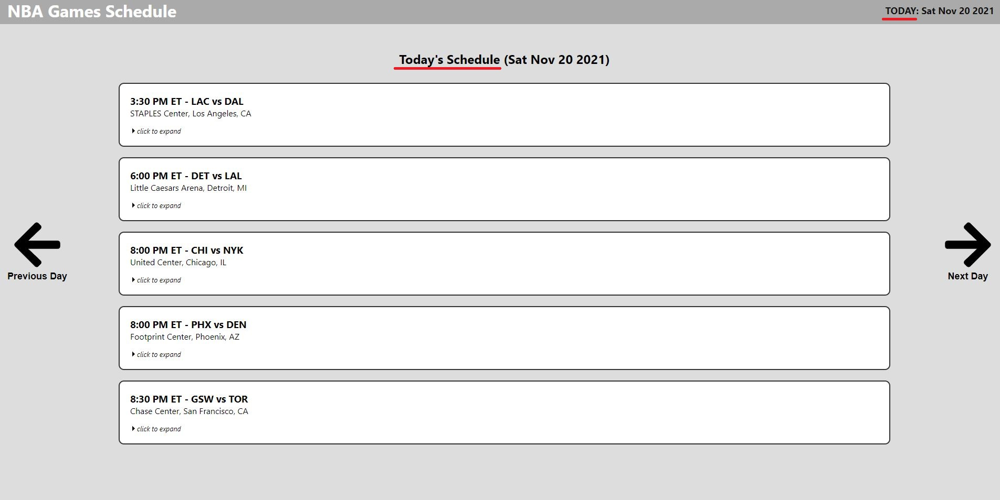

# NBA-ScoreData
ReactJS Front End Application based on past, present, and future schedules of daily NBA score data statistics provided by https://data.nba.net/10s/prod/v1/today.json

---
## Getting Started (VS Code)
1. Open a terminal (Powershell or Git)
2. Type `cd client` and press enter to open the ReactJS client folder
3. Type `yarn install` and press enter to install the package.json modules (react-router-dom, react-icons, styled-components, etc...)
4. Type `yarn start` and press enter to start the React App Client.
5. Once you are finished, press `Ctrl` + `C` to terminate the ReactJS local host.

**NOTE**: this repository is also configured to allow simple execution of `yarn start` directly from the root repository folder (/NBA-SCOREDATA/) instead of continuously repeating step 2 and 4 to start the application.

---
## NBA Score Data and Game Schedules

Home page (underline indicates the current date of the game schedules based on GMT+0000, Greenwich Mean Time, London).

Each game schedule shows the time in ET (GMT-0500, New York), which teams are participating (home vs visitor), and the name and location of the arena venue.

Users are able to press on the arrow keys to move to see game schedules for past days or for future matches. Matches without a defined scheduled time is replaced with a "TBD" (to be determined).

Games whose matches have already concluded have the scores listed along with which team won that game. Games that are currently underway will have a orange note that indicates the game is ongoing. Scores and team record aggregates (*see below for screenshot example*) may also have a TBD especially if this is their first series competing.

You can also click on "click to expand" in each schedule bubble to learn more about the local and series wins and losses. An expanded schedule will also have the box border colored in green. In addition, you can "click to collapse" to hide the details.

---
## Questions, Comments, Changes, or Suggestions ?

Feel free to fork and borrow this repository for your own use, and any changes you want to suggest, feel free to make a pull request with your suggested changes and your comments to indicate what needs to be changed and/or improve.

**Please note I will `IGNORE and DISREGARD` any requested changes that does not include a comment, feedback, note, or any indication of what, where, or why you are requesting the change!**

I can also be reached at my email address: bcha92@hotmail.com or my LinkedIn: https://www.linkedin.com/in/brandoncha/